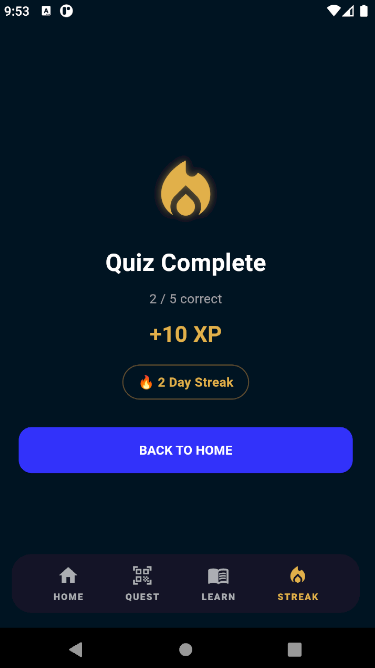

# AeroQuest

A gamified aviation learning platform built with Flutter and Supabase.

## Features

• Quiz-based learning modules  
• QR code practical quests  
• XP reward and ranking system  
• Daily streak challenges  
• Real-time dashboard updates  

## Tech Stack

Flutter  
Supabase  
PostgreSQL  
Realtime subscriptions  
QR scanning

## Demo

## Demo

Watch the demo video here:
(https://youtube.com/shorts/45r5AQWM5Eg?feature=share)

## APK

Download the Android APK:
https://github.com/Raan010101/AeroQuest/releases/download/v1.0/aeroquest_v1.apk

## Screenshots

